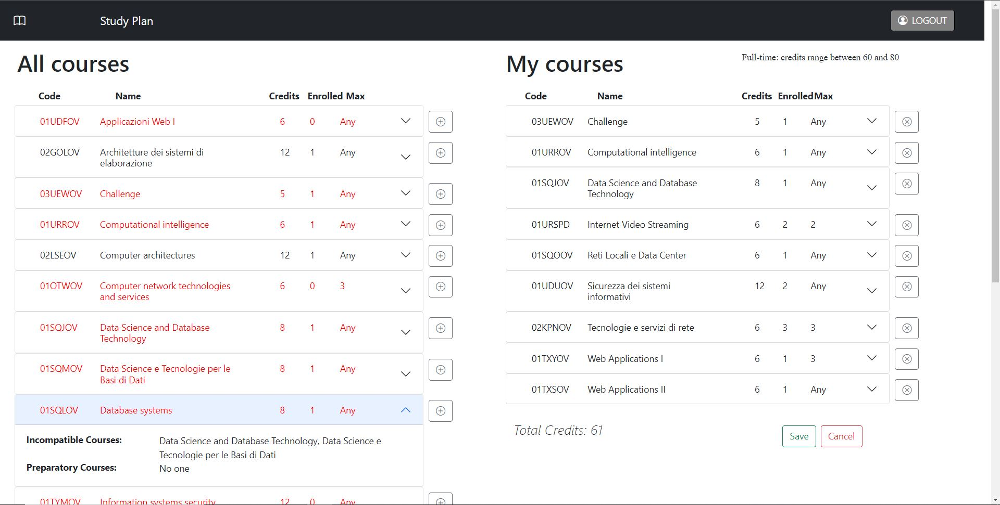

# Exam #1: "StudyPlan"
## Student: s296962 GRANDE FRANCESCO 

## React Client Application Routes

- Route `/login`: the page contains a login form, it allows the student to access all the app functionalities
- Route `/home`: main page of the app, if not logged in it contains the list of all courses offered from the server, if logged in it contains also a form for creating or editing a studyplan with some small indications

## API Server

- GET `/api/courses`
  - request parameters or constraint: none
  - response body: array containing all courses offered by the app
- GET `/api/studyplan`
  - request constraint: be authenticated
  - response body: array containing all courses of the studyplan of the logged student
- GET `/api/sessions/current`
  - request constraint: be authenticated
  - response body: logged student information
- POST `/api/plan`
  - request constraint: be authenticated
  - request body: array containing all courses of the edited studyplan of the logged student
  - response body: empty
- POST `/api/sessions`
  - request body: student credentials
  - response body: logged student information
- DELETE `/api/plan`
  - request constraint: be authenticated
  - request body: empty
  - response body: empty
- DELETE `/api/sessions/current`
  - request constraint: be authenticated
  - request body: empty
  - response body: empty

## Database Tables

- Table `students` - all the students who can access the app are here, contains id, email, name, hashed password and its salt
- Table `studyplan` - all the studyplans are here, contains the course code and the id of the student who has that course in his plan 
- Table `courses` - all the courses that can be chosen are here, contains code, name, credits, enrolledstudents, maxstudents, incompatible, preparatory

## Main React Components

- `NavBar` (in `NavBar.js`): a navbar always on top of the page, it contains, if not logged, the login button that can redirect you to the login page, if in the login page the home button that can redirect you to the home without performing login, if logged the logout button that can perform logout
- `LoginForm` (in `AuthForm.js`): login form, it allows the student to perform login
- `CoursesTable` (in `CoursesTable.js`): a list of courses, it's an accordion whose headers contain the courses always visibile information and the collapsible bodies contain the incompatible and preparatory courses information, with buttons appearing in edit mode for adding and deleting the courses from the studyplan
- `StudyPlanForm` (in `StudyPlanForm.js`): the form for creating or editing a study plan, contain a nested courses table which is the study plan and can be filled using the appropriate add/remove buttons, contain the buttons for saving and deleting the study plan, the button for undoing the changes if the study plan is still not saved persistently, the total number of credits of the studyplan if not empty

## Screenshot

## Users Credentials

- mario.rossi@polito.it, password (still no plan)
- davide.fonte@polito.it, camplus (still no plan)
- raffaele.sarpi@polito.it, chess (part-time plan)
- dayana.angelino@polito.it, rose (part-time plan)
- kim.lennon@polito.it, rhove (full-time plan)
